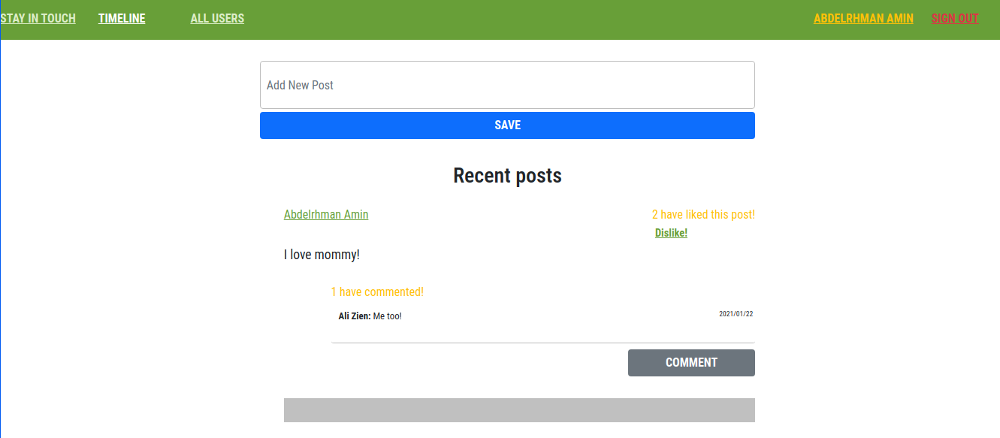

# Social Media App

In this project we built an Social Media application. You can sign up with and email and password and then create posts, add other user as friends, read the post of your friends, coment and give them a like.

## Screenshots




## Built With

- Ruby v2.7.0
- Ruby on Rails v5.2.4
- Rubocop
- Rspec & Capybara for testing
- Devise Gem

## Live Demo

TBA

## Getting Started

To get a local copy up and running follow these simple example steps.

### Prerequisites

Ruby: 2.6.3
Rails: 5.2.3
Postgres: >=9.5

### Setup

Instal gems with:

```
bundle install
```

Setup database with:

```
   rails db:create
   rails db:migrate
```

### Usage

Start server with:

```
    rails server
```

Open `http://localhost:3000/` in your browser.

### Run tests

```
    bundle exec rspec
```

### Deployment

TBA

## Authors

😎 **Abdo Amin**

- GitHub: [@Abdelrhman-Amin](https://github.com/AbdelrhmanAmin)
- Twitter: [@Abdo Amin](https://twitter.com/AbdoAmi60489112)
- LinkedIn: [@Abdo Amin](https://www.linkedin.com/in/abdo-amin-ab786a1b0/)

## Show your support

Give a ⭐️ if you like this project!

## Acknowledgments

- [Microverse](https://www.microverse.org/).

## 📝 License

This project is [MIT licensed](./LICENSE).
